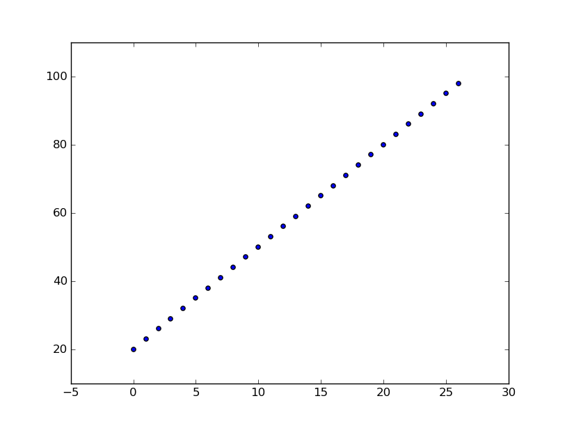

# Visualising Sorting With Python 1 - Graphing Data

## Introduction

Academics in the fields of mathematics, the sciences and the Humanities often need to present the data from their research and experiments. A key tool used by many academics is the Python programming language, along with a library called matplotlib. In fact, matplotlib is fast becoming the standard graphing tool used in scientific publications.

In this lesson you will be learning how to use Python to create lists of numbers, and then using matplotlib to graph those numbers.

## Producing lists of numbers

A list is a data structure - a way of storing data. If you wanted to store the numbers `0` to `9` in Python, you could write a list like this:

	```python
	numbers = [0,1,2,3,4,5,6,7,8,9]
	```

That's fairly simple for small lists, but if you wanted all the numbers from `0` to `9999` you would be typing for quite a long time. Uf you ever find yourself performing a very repetitive task when programming, there's probably an easier way of doing it. In this case, a fairly simple way to create the 10000-number list would be to use a loop.

1. Open your Python IDE and type the following into a new file called `lists.py`:

	```python
	numbers = []
	for i in range(10000):
		numbers.append(i)
	```

1. Run your code and then type `numbers` into the interpreter to see the list you have created.

## List comprehensions

Creating lists with loops is fairly simple, but there's a more powerful way of creating lists in many languages, called a **list comprehension**. The list creation above can be simplified to:

```python
numbers = [i for i in range(10000)]
```

The first `i` is the value that's going to be placed in the list; the second `i` represents every value between 0 and 10000.

Have a go at making the following lists using list comprehensions:

1. [0,1,2,3,4,5,6,7,8]

1. [0,1,2,3,4,5,6,7,8,9,10,11,12,13,14,15]

You can use the full range of parameters available in the `range()` function in a list comprehension, so if you wanted to start at a different value to produce `[5,6,7,8,9]`, for instance, you could write the following:

	```python
	numbers = [i for i in range(5,10)
	```

Try using list comprehensions to create the following lists:

1. [10,11,12,13,14,15,16,17,18,19]

1. [-5,-6,-7,-8,-9,0]

You can also pass a step value into the `range()` function to get lists that skip numbers, such as `[0,2,4,5,8]`:

```python
numbers = [i for i in range(0,10,2)]
```

Try using list comprehensions to create the following lists:

1. [0,3,6,8,12]

1. [10,8,6,4,2,0]

1. [0,-1,-2,-3,-4,-5]

## Graphing lists of numbers

1. To produce a standard graph, you need to use two sets of values. Open up a new Python file and call it `graphing.py`.

1. You can start by producing two lists of numbers to graph. It doesn't really matter what numbers they are, but they must be the same length. We can achieve this by using the built-in `len()` function in Python. Call the lists `y` and `x`:

	```python
	y = [i for i in range(20,100,3)]
	x = [i for i in range(len(y))]
	```

1. Now that you have the numbers, you can create a graph to display them. To do this, you'll need to use the matplotlib library. At the top of your file write the following line:

	```python
	import matplotlib.pyplot as plt
	```

1. To create a simple scatter graph of the numbers, you can just write the following two lines at the bottom of your file:

	```python
	plt.scatter(x,y)
	plt.draw()
	```

1. Your entire file should now look like this:

	```python
	import matplotlib.pyplot as plt

	y = [i for i in range(20,100,3)]
	x = [i for i in range(len(y))]


	plt.scatter(x,y)
	plt.draw()
	```

1. A window should appear containing your graph:

	

1. Close the window. You can now try drawing some different styles of graph. Alter this line:

	```python
	plt.scatter(x,y)
	```

so that it reads:

	```python
	plt.plot(x,y)
	```

then run your code again.

1. You can also try `plt.bar`.

2. If you want to have a scatter plot with the points joined up, you can combine `plot` and `scatter`:

	```python
	plt.plot(x,y)
	plt.scatter(x,y)
	```

	

1. Try to alter your `y` list comprehension, and the type of graph you're drawing, to produce the following three graphs:


## Interactive and random plotting

To finish off this section, you're going to learn how to plot an interactive graph that updates as the values change.

1. Create a new file called `random_plot.py`.

1. This time you'll need a couple of extra libraries. Write the following three lines at the top of your file:

	```python
	import matplotlib.pyplot as plt
	from time import sleep
	from random import shuffle
	```

1. Next, tell your program to turn on `interactive plotting`:

	```python
	plt.ion()
	```

1. Then choose the `x` and `y` lists:

	```python
	y = [i for i in range(100)]
	x = [i for i in range(len(y))]
	```

1. You're going to use a loop to update the graph and keep shuffling the `y` list around so that the values keep changing. You'll also need to clear the plot each time. The comments in the code below explain each line:

   ```python
   for i in range(50):       ## Do the following 50 times
	   plt.clf()             ## Clear the plot
	   plt.bar(x,y)          ## Plot a bar chart
	   plt.draw()            ## Draw the bar chart
	   sleep(0.5)            ## Pause for 1/2 a second
	   shuffle(y)            ## Shuffle the data

   ```

1. Run your code to see the live plot. If it gives an error, check it's the same as the code below:

	```python
	import matplotlib.pyplot as plt
	from time import sleep
	from random import shuffle


	plt.ion()

	y = [i for i in range(100)]
	x = [i for i in range(len(y))]

	for i in range(50):
		plt.clf()
		plt.bar(x,y)
		plt.draw()
		sleep(0.5)
		shuffle(y)
	```


## More matplotlib

- matplotlib allows you to produce accurate scientific graphs, which should always contain a title and labelled axes. Use online resources to try and find out how to add labels and axes to your graphs.
